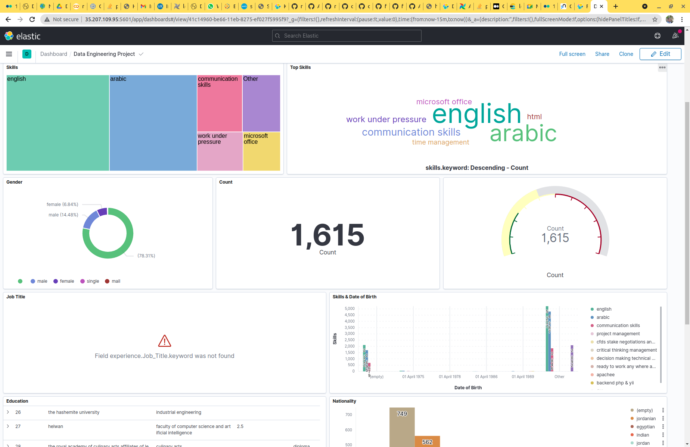
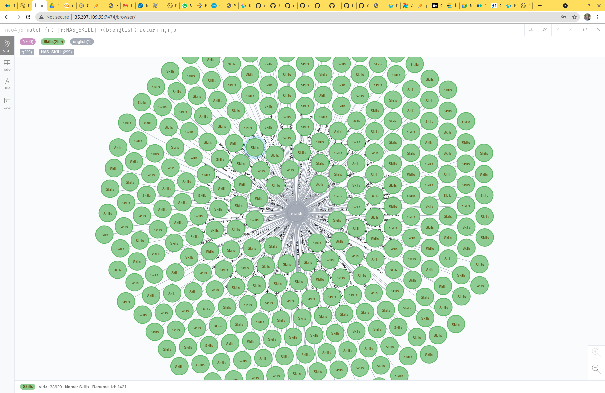

# Data Engineering Project

***

the project aims to take resumes as input then translate them into json and make relations

we have 2 representations for the Data

1. Graph Representation using [neo4j](https://neo4j.com/)
2. Tabular representation using [elastic search](https://www.elastic.co/)





***

## Technology

we used the following docker images

1. [postgres](https://hub.docker.com/_/postgres)
2. [redis](https://hub.docker.com/_/redis)
3. [airflow](https://hub.docker.com/r/apache/airflow)
4. [neo4j](https://hub.docker.com/_/neo4j)
5. [elasticsearch](https://www.docker.elastic.co/r/elasticsearch/elasticsearch)
6. [kibana](https://www.docker.elastic.co/r/kibana/kibana)
7. [our front end (react.js)](https://hub.docker.com/r/abdelrahmanayyad/de-fe)
8. [our back end (spring)](https://hub.docker.com/r/abdelrahmanayyad/de-be)

to run the stack just `bash script.sh` then the script will deploy it using [docker compose](https://docs.docker.com/compose/)

to use the application you can go the [web app](http://localhost) and upload the PDF file manually

another way is using curl

```
curl --location --request POST 'http://localhost:9091/upload' \
--header 'Content-Type: multipart/form-data' \
--form 'file=@"sample_cv/CV_DATA.pdf"'
```

***

### folder structure

1. [backend](./backend) contains the backend application in addition to [Dockerfile](./backend/Dockerfile) to build the image.
2. [upload-page](./upload-page) contains the react application in addition to [Dockerfile](./upload-page/Dockerfile) to build the image.
3. [dags](./dags) is a shared docker volume contains the dag file for the airflow.
4. [data](./data) is a shared docker volume contains the resumes and converted json data.
5. [neo_plugins](./neo_plugins) is a shared docker directory contains neo4j plugins currently it has the [apoc](https://neo4j.com/developer/neo4j-apoc/) but we ended up not using it in the project
6. [sample_cv](./sample_cv) a directory contains a sample cv (my cv) for testing
7. [script.sh](script.sh) a script to run the stack